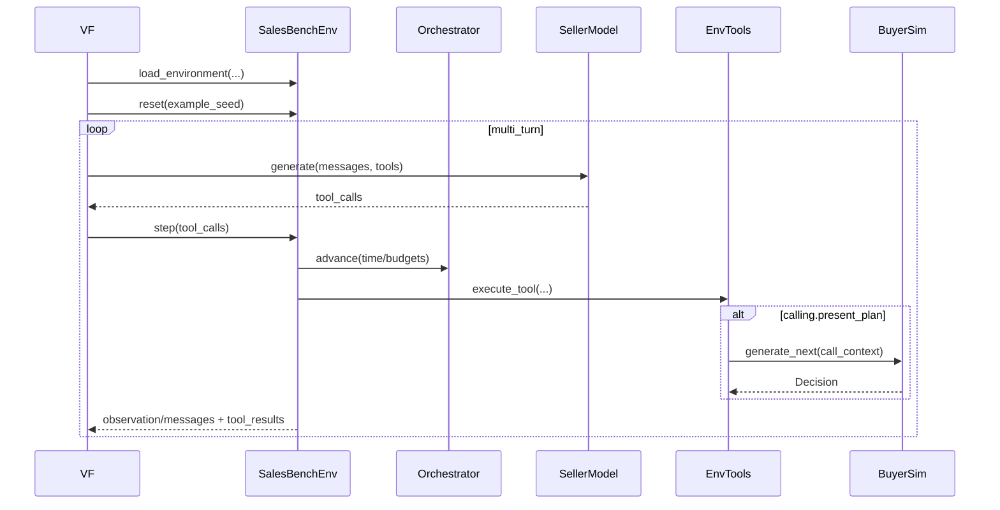

## Goals

- **Prime Intellect compatible**: publishable Verifiers environment with `load_environment(...) -> vf.Environment`.
- **Benchmark-aligned**: 100 leads, 10 simulated business days, multi-call memory, realistic interruptions.
- **Strict protocol**: seller uses tools; buyer emits only `{ACCEPT_PLAN|REJECT_PLAN|END_CALL}` during calls.
- **Environment is canonical**: state and tools live in the environment; orchestrator is a state machine (not an agent).
- **RL-ready**: bounded horizons, serializable state, rubric reward + metrics suitable for later Prime-RL.

## Architecture

### High-level components

- **Runner (CLI/API, optional outer layer)**: starts N episodes (seeded), sets configs/parallelism, and (optionally) streams telemetry/storage.
- **Orchestrator**: a turn/state machine that owns time (10 business days), budgets, and termination; it calls the seller and routes tool calls.
- **Seller (evaluated model)**: proposes actions via tool calls (MVP).
- **Environment**: canonical state owner (Leads/CRM/Calendar/CallSessions/EventQueue) and the only place tools execute.
- **Buyer simulator**: activated only inside `calling.present_plan`, returning only a Decision (plus an optional reason string for the tool result). `END_CALL` is realized by the environment executing `calling.end_call(...)`.
- **ContextManager**: shared context builder/compactor for seller + buyer LLM calls.

### Core loop (compatible with Verifiers + later Prime-RL)



## Protocol (single source of truth)

Implement in `salesbench/core/protocol.py`:

- **Seller (MVP)**: tool calls only (no free-form dialogue).
- **Buyer**: decision only and always **structured**:
- `ACCEPT_PLAN(plan_id)` or `REJECT_PLAN(plan_id)` (plan must exist in catalog)
- `END_CALL` (buyer ends the call)
- **Buyer activation**: buyer decisions occur only via the return of `calling.present_plan(...)`.
- **Environment-only tools**: all tool side effects happen inside `SalesEnv.execute_tool(...)`.

## Tools (minimal MVP)

### Tool access (explicit)

- **Seller tool access**: may call `crm.*`, `calendar.*`, `calling.*`, and `products.*` tools (subject to budgets/termination enforced by the Orchestrator and Environment).
- **Buyer tool access**: none. The buyer never issues tool calls; it is invoked internally by the `calling.present_plan` tool and can only return a Decision.
- **Orchestrator tool access**: none directly. It routes seller tool calls to `SalesEnv.execute_tool(...)` and advances time/budgets/termination.
- **Environment tool access**: executes all tools and applies state transitions; it is the only canonical owner of side effects.

### CRM

- `crm.search_leads(filters)`
- `crm.get_lead(lead_id)`
- `crm.update_lead(lead_id, patch)`
- `crm.log_call(lead_id, timestamp, outcome, plan_summary)`

### Calendar

- `calendar.get_availability(day)`
- `calendar.schedule_call(lead_id, datetime)`

### Calling (Buyer only “speaks” here)

- `calling.start_call(lead_id) -> call_id`
- `calling.present_plan(call_id, plan_id, offer) -> {decision: ACCEPT_PLAN|REJECT_PLAN|END_CALL, plan_id|null, reason}`
- `calling.end_call(call_id, reason)`

### Products (read-only catalog + quoting)

The seller should be able to fetch the plan list while brainstorming, without relying on hidden prompt text. Keep these tools side-effect free.

- `products.list_plans() -> [{plan_id, name, kind, line_of_business, term_years|null, is_permanent, cash_value, underwriting}]`
- `products.get_plan(plan_id) -> {plan_id, fields...}`
- `products.quote_premium(lead_id, plan_id, offer) -> {monthly_premium, assumptions}`

## Persona generation (seeded, realistic)

Each lead has a deterministic persona generated from `(episode_seed, lead_id)`.

### Persona dimensions (MVP)

- **Public fields**: name, age, job category, income band, household, “trigger” (house, baby, health scare), objection style, timezone/availability hints.
- **Hidden state**: `trust`, `interest`, `patience`, `dnc_risk`, `close_threshold`, plus optional “price_sensitivity” and “time_sensitivity”.
- **Multi-call memory**: remembers promises/claims, previous plan summaries, and bad experiences; this influences future decisions.

### Archetype-driven sampling

Define ~10–20 archetypes with parameter ranges, e.g.:

- analytical_lukewarm (low initial trust, medium interest, high price sensitivity)
- hostile_cold (very low trust, high dnc_risk)
- warm_but_busy (high interest, low patience, time crunch prone)
- skeptical_budget (medium trust, low budget, asks for numbers)

### Random events (seeded)

Events sampled per call (with fixed probabilities, seeded):

- spouse_involvement
- child_interruption
- competing_priority
- emotional_trigger

Events modify hidden state and impose call constraints (e.g., “wrap up in 2 minutes”).

### Lead seeding script / utility (100 leads)

Add a small utility that generates the full lead book deterministically for a given seed, inspired by `docs/ARCHITECTURE.md`:

- Use a **realistic intent distribution** (e.g., HOT ~3%, WARM ~12%, LUKEWARM ~35%, COLD ~40%, HOSTILE ~10%).
- Generate personas in a **batch** using `seed + i` so the same seed yields the same 100 leads.
- **No duplicates / rerunnable**: lead generation always produces exactly `n` leads with stable IDs (e.g., `lead_000`..`lead_099`) and **replaces** the in-memory lead book on each run/reset (no “append” behavior).

Proposed entrypoint(s):

- **Library function**: `salesbench/envs/sales_mvp/personas.py::generate_leads(seed, n=100) -> list[Lead] `(used by `SalesEnv.reset` / `load_environment` examples).
- **Library function**: `salesbench/envs/sales_mvp/personas.py::generate_leads(seed, n=100) -> list[Lead] `(used by `SalesEnv.reset` / `load_environment` examples).
- **Debug script/CLI** (no local files required): `salesbench/cli/main.py seed-leads --seed 123 --n 100` prints a JSON/pretty summary to stdout.

## Insurance plans (canonical catalog)

Define a small, fixed product catalog so recommendations and outcomes are comparable. We align plan categories to a real carrier taxonomy (see [New York Life insurance products](https://www.newyorklife.com/products/insurance)).

### Plans (MVP)

- **`TERM` Term life insurance** (Life): temporary protection; can be framed as convertible to permanent (feature flag).
- **`WHOLE` Whole life insurance** (Life): permanent with guaranteed death benefit + cash value.
- **`UL` Universal life insurance** (Life): customizable long-term coverage (simplified).
- **`VUL` Variable universal life insurance** (Life): market-linked cash value (simplified).
- **`LTC` Long-term care insurance** (LTC): helps pay for in-home care / support with everyday tasks.
- **`DI` Individual disability insurance** (Disability): replaces a portion of lost income if sickness/injury prevents working.

### Presenting a plan (structured offer)

The seller should present plans in a structured schema so we can run clean experiments and compute metrics consistently.Common fields (all plans):

- `plan_id`: one of `TERM | WHOLE | UL | VUL | LTC | DI` (must match the `plan_id` argument)
- `monthly_premium`: number (quoted via `products.quote_premium`)
- `next_step`: `SCHEDULE_FOLLOWUP | REQUEST_INFO | CLOSE_NOW`

Life offers (`TERM|WHOLE|UL|VUL`) add:

- `coverage_tier`: `250k | 500k | 1M`
- `term_years`: `20 | 30` (only for `TERM`)
- `underwriting`: `SIMPLIFIED | FULL`
- `riders`: list of rider IDs (optional)

Disability offers (`DI`) add:

- `monthly_benefit`: `2000 | 4000 | 6000` (USD)
- `benefit_duration_years`: `2 | 5 | 10`
- `elimination_days`: `30 | 90`

Long-term care offers (`LTC`) add:

- `monthly_benefit`: `3000 | 6000 | 9000` (USD)
- `benefit_duration_years`: `2 | 3 | 5`
- `elimination_days`: `30 | 90`

Buyer decisions are always keyed by `plan_id` (or `END_CALL`).

### Coverage tiers (MVP)

- **Life (TERM/WHOLE/UL/VUL)**: 250k, 500k, 1M face amount tiers.
- **DI**: monthly benefit tiers (2k/4k/6k).
- **LTC**: monthly benefit tiers (3k/6k/9k).

### Riders (optional toggles, life only)

- accidental_death
- child_rider
- waiver_of_premium

### Pricing + eligibility (deterministic, tunable)

Pricing is deterministic and tunable. Use separate pricing models by line.

#### Life pricing (TERM/WHOLE/UL/VUL)

- **Risk class (MVP)**: `PREFERRED | STANDARD | SMOKER` derived from persona health flags.
- **Age bands (MVP)**: `25-34`, `35-44`, `45-54`, `55-64`.
- **Coverage multiplier**: `mult = coverage_amount / 100000`.

Base monthly premium rates per 100k of coverage (USD), by plan, age band, risk class (PREFERRED / STANDARD / SMOKER):

- **Term 20 (`TERM`, term_years=20)**:
- 25-34: 7 / 10 / 17
- 35-44: 9 / 13 / 22
- 45-54: 20 / 28 / 45
- 55-64: 45 / 62 / 95
- **Term 30 (`TERM`, term_years=30)**:
- 25-34: 9 / 12 / 20
- 35-44: 12 / 16 / 28
- 45-54: 26 / 34 / 55
- 55-64: 60 / 80 / 130
- **Whole (`WHOLE`)**:
- 25-34: 90 / 110 / 150
- 35-44: 130 / 160 / 220
- 45-54: 220 / 270 / 360
- 55-64: 420 / 520 / 700
- **Universal Life (`UL`)**:
- 25-34: 40 / 50 / 80
- 35-44: 60 / 75 / 110
- 45-54: 110 / 140 / 210
- 55-64: 210 / 270 / 400
- **Variable Universal Life (`VUL`)**:
- 25-34: 50 / 65 / 95
- 35-44: 75 / 95 / 135
- 45-54: 140 / 180 / 260
- 55-64: 260 / 340 / 500

Compute life quote:

- `premium = base_rate(plan, age_band, risk_class) * mult`
- Underwriting adjustment:
- `SIMPLIFIED`: `premium * 1.10`
- `FULL`: `premium * 1.00`

#### Disability insurance pricing (DI)

Model DI as income replacement (as described in [New York Life insurance products](https://www.newyorklife.com/products/insurance)).

- **Occupation class (MVP)**: `OFFICE | MIXED | MANUAL` derived from persona occupation.
- **Elimination period**: 30 vs 90 days.
- **Benefit cap**: `monthly_benefit <= 0.6 * monthly_income`.

Deterministic quote (USD/month):

- `base = {2000: 35, 4000: 65, 6000: 95}[monthly_benefit]`
- `age_factor = {25-34: 1.0, 35-44: 1.2, 45-54: 1.6, 55-64: 2.3}[age_band]`
- `occ_factor = {OFFICE: 1.0, MIXED: 1.25, MANUAL: 1.6}[occupation_class]`
- `elim_factor = {30: 1.2, 90: 1.0}[elimination_days]`
- `premium = base * age_factor * occ_factor * elim_factor`

#### Long-term care pricing (LTC)

Model LTC as reimbursing/supporting costs for everyday tasks/in-home care (as described in [New York Life insurance products](https://www.newyorklife.com/products/insurance)).Deterministic quote (USD/month):

- `base = {3000: 60, 6000: 110, 9000: 160}[monthly_benefit]`
- `age_factor = {25-34: 0.7, 35-44: 0.9, 45-54: 1.3, 55-64: 2.0}[age_band]`
- `dur_factor = {2: 1.0, 3: 1.15, 5: 1.35}[benefit_duration_years]`
- `elim_factor = {30: 1.15, 90: 1.0}[elimination_days]`
- `premium = base * age_factor * dur_factor * elim_factor`

Acceptance depends on:

- fit between persona budget and quoted premium
- trust/interest thresholds and objection pattern
- underwriting friction and patience

The seller’s plan submitted to `calling.present_plan` should reference a `plan_id`, the relevant offer fields for that plan, and a next step.

## Metrics engine (event log + per-model aggregation)

Add a small metrics layer (separate from the scoring rubric) that consumes the environment **event log** and produces a stable set of KPIs. This makes debugging and benchmarking easier, and supports per-model comparisons.

### Event log (what we record)

Emit structured events from the Environment/Orchestrator (and include them in Verifiers trajectory `info` / rubric inputs):

- `episode_started`, `episode_ended`
- `day_advanced`
- `lead_selected`
- `call_started(call_id, lead_id)`, `call_ended(call_id, outcome)`
- `tool_called(tool_name, requestor, args_summary)`, `tool_succeeded(tool_name)`, `tool_failed(tool_name, error_type)`
- `plan_presented(plan_id, offer_summary)`, `plan_decision(plan_id, decision)`
- `deal_closed(plan_id, lead_id, premium, line_of_business)`

### Core metrics (per episode)

- **Deals**: number of accepts/closes by `plan_id` and by line (`Life`, `DI`, `LTC`)
- **Time-to-close**: (days since episode start) to first close; and per-lead days-to-close
- **Efficiency**: calls/day, tool calls/episode, tool calls/close
- **Tool health**: tool failure rate by tool name; protocol violations count
- **Buyer outcomes**: accept/reject/end counts; reject rate by plan_id

### Per-model aggregation

Verifiers provides the evaluated model identifier; the metrics engine should aggregate:

- per model name (and optionally provider)
- per seed / per persona segment (intent type, risk class, occupation class)

### Where metrics live

- **In the publishable env**: emitted as rubric metrics (non-reward) so they show up in Verifiers outputs.
- **In the optional ops layer**: streamed to Supabase and/or OpenTelemetry (if enabled) for dashboards.

## Scoring / rubric (RL-ready)

Implement in `salesbench/envs/sales_mvp/verifiers/scoring.py`:

- **Primary reward (terminal)**: weighted combination of
- accepts / closes (or scheduled qualified follow-up)
- profit proxy (premium * retention proxy)
- time efficiency (calls/day, wasted calls, over-calling penalties)
- inference cost (tokens / $ cost from model requests)
- **Metrics (non-reward)**: accepts, rejects, ends, DNC events, avg call length, follow-up rate, cost, etc.

Ensure bounded horizons:

- max calls/day
- max tool steps/episode
- max turns/call session

## Directory structure

```text
salesbench/
  environments/
    salesbench/
      salesbench.py            # Verifiers entrypoint: load_environment(...)
      pyproject.toml           # env package metadata + [tool.verifiers.eval] defaults
      README.md

  salesbench/
    core/
      types.py
      protocol.py
      config.py
      errors.py

    context/
      manager.py
      buffers.py
      compaction/
        base.py
        simple_summary.py
        key_events.py
      policies.py
      serializers.py

    agents/
      base.py
      seller_llm.py
      seller_heuristic.py
      buyer_llm.py

    orchestrator/
      orchestrator.py
      budgets.py
      termination.py

    envs/
      sales_mvp/
        env.py
        state.py
        personas.py
        products.py
        tools/
          crm.py
          calendar.py
          calling.py
          tool_metadata.yaml
        verifiers/
          scoring.py

    llm/
      client.py
      tool_schema.py
      parsing.py

    storage/
      supabase_writer.py        # optional outer-layer integration
      schema.sql

    telemetry/
      otel.py                   # optional outer-layer integration
      spans.py

    cli/
      main.py                   # optional runner entrypoint
```

## Implementation plan (MVP-first)

1. **Publishable Verifiers environment** (`environments/salesbench/`): implement `load_environment(...)` and default eval config.
2. **Core types + protocol**: strict seller/buyer constraints in `core/protocol.py`.
3. **Personas + products**: seeded persona generator + product catalog/pricing in `envs/sales_mvp/`.
4. **Environment + tools**: canonical state + CRM/Calendar/Calling tools; buyer invoked only inside calling tool.
5. **Orchestrator**: 10-day portfolio loop, budgets/termination, call session flow.
6. **Rubric**: reward + metrics; pass^k aggregation hooks.

7. **Baselines**: heuristic seller + LLM seller; constrained buyer LLM sim.
8. **Optional ops layer**: Supabase + OTel/Grafana integrations outside the publishable env package.